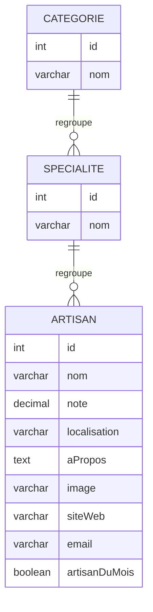

# Modélisation de la base de données — Trouve ton artisan

## 1. Règles de gestion

- Un artisan appartient à **une seule** spécialité.
- Une spécialité est rattachée à **une seule** catégorie.
- Une catégorie regroupe **plusieurs** spécialités.
- Une spécialité regroupe **plusieurs** artisans.
- Les 4 catégories affichées dans le menu (alimentées depuis la base) sont : Bâtiment, Services, Fabrication, Alimentation.
- Un artisan peut être mis en avant comme « artisan du mois » (page d'accueil, 3 artisans maximum affichés côté frontend).

## 2. MCD (Modèle Conceptuel de Données)



Cardinalités :
- CATEGORIE (1,1) — (0,N) SPECIALITE : une spécialité appartient à une seule catégorie, une catégorie a 0 à N spécialités.
- SPECIALITE (1,1) — (0,N) ARTISAN : un artisan appartient à une seule spécialité, une spécialité a 0 à N artisans.

## 3. MLD (Modèle Logique de Données)

```
CATEGORIE (id, nom)
  PK : id

SPECIALITE (id, nom, categorieId)
  PK : id
  FK : categorieId → CATEGORIE(id)

ARTISAN (id, nom, note, localisation, aPropos, image, siteWeb, email, artisanDuMois, specialiteId)
  PK : id
  FK : specialiteId → SPECIALITE(id)
```

La clé étrangère `categorieId` porte la relation (0,N) côté SPECIALITE, et `specialiteId` porte la
relation (0,N) côté ARTISAN : c'est la table du côté « plusieurs » qui reçoit la clé étrangère.

## 4. Scripts SQL associés

- [`database/create.sql`](../database/create.sql) : création des 3 tables (`categories`, `specialites`, `artisans`)
  avec contraintes de clé étrangère (`ON DELETE CASCADE`).
- [`database/seed.sql`](../database/seed.sql) : alimentation à partir du jeu d'essai fourni
  (`fichiers-à-joindre-au-devoir/data.xlsx`) — 4 catégories, 15 spécialités, 17 artisans.

## 5. Justification des choix

- **Normalisation en 3 tables** plutôt qu'une seule table plate : évite la redondance du nom de
  catégorie/spécialité sur chaque artisan et respecte les règles de gestion (1 artisan → 1 spécialité
  → 1 catégorie).
- **`ON DELETE CASCADE`** : si une catégorie ou une spécialité est supprimée, les enregistrements
  dépendants le sont aussi (cohérence référentielle), à réévaluer si l'application d'administration
  doit plutôt interdire la suppression d'une catégorie non vide.
- **`artisanDuMois` (booléen)** plutôt qu'une date : permet de sélectionner simplement les artisans
  mis en avant sur la page d'accueil (`WHERE artisanDuMois = TRUE`), à gérer manuellement ou via une
  tâche planifiée par la future application d'administration.
